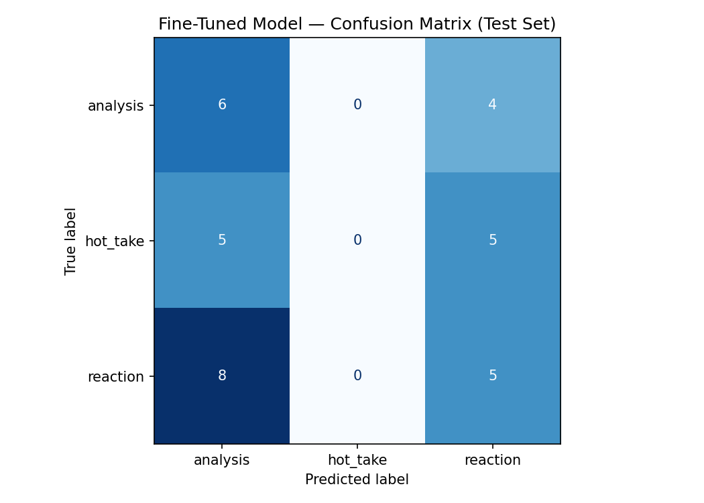

# ai201-proj3-takemeter
TakeMeter: a fine-tuned text classifier that evaluates discourse quality in an online community of your choosing. I define the labels, collect and annotate the data, fine-tune a model, and then honestly assess where it works and where it falls apart

## Milestone 4 — Evaluation

**Task:** 3-way classification of r/formula1 comments → `analysis`, `hot_take`, `reaction`.
**Test set:** 33 held-out comments (stratified 70/15/15 split of 220 labeled).

### Results

| Model                              | Accuracy | Macro F1 |
|-----------------------------------|---------:|---------:|
| Zero-shot baseline (Groq Llama-3.1) | **0.576** | 0.55 |
| Fine-tuned DistilBERT (3 epochs)    | 0.333    | 0.26 |

Fine-tuning **regressed by 24.2 points** vs. the zero-shot baseline.

### Confusion Matrix (Fine-tuned)

The fine-tuned model **never predicted `hot_take`** (entire column = 0) and split everything else between `analysis` and `reaction`. Validation accuracy across epochs: 0.27 → 0.27 → 0.39 — the model was still under-fit when training stopped.

### Why the baseline won

1. **Dataset size.** 154 training rows is far below what a 66M-parameter encoder needs to learn a subjective 3-class boundary. The zero-shot LLM brings pretraining knowledge of F1 discourse that fine-tuning on 154 rows cannot replace.
2. **Class collapse.** With only ~50 `hot_take` examples and a fuzzy boundary against `analysis` (reasoned opinion) and `reaction` (emotional opinion), the model learned to ignore the class entirely.
3. **Under-training.** Loss dropped only 0.027 over 3 epochs at default LR — the optimizer barely moved. More epochs, a higher learning rate, or class-weighted loss would all help.

### Three wrong fine-tuned predictions

1. *"Always very good around Austria plus the Barcelona update seems to have brought Ferrari right to the front…"* — true `hot_take`, predicted `analysis` (0.35). Reasonable confusion: the comment mixes prediction (hot_take cue) with technical reasoning (analysis cue). The rubric tie-breaker calls this `hot_take`, but the model latched onto the technical vocabulary.
2. *"After he retires and if Zandvoort comes back they should rename it Verstappen Circuit"* — true `hot_take`, predicted `reaction` (0.36). The model read the emotional phrasing as `reaction` and missed the opinion claim.
3. *"lol if Kimi had clear air and podium pace, who's to say he doesn't pull out more than 5 seconds?"* — true `analysis`, predicted `reaction` (0.35). The "lol" and rhetorical question fooled the model despite the counterfactual reasoning.

All three confidences sit at 0.33–0.36 — essentially uniform over 3 classes, confirming the model never learned to discriminate.

### What would change with 2,000 labeled examples

With ~10× more data I'd expect the fine-tuned DistilBERT to **overtake the zero-shot baseline by 5–15 points**. Specifically: (a) `hot_take` would stop collapsing because there would be enough positive examples (~650) to learn the opinion/prediction pattern; (b) the loss curve would actually descend and 3 epochs would be sufficient; (c) per-class F1 would tighten — currently `reaction` is the only class with usable recall (0.38). I would also add class-weighted cross-entropy and early stopping on validation macro-F1 rather than accuracy, so the minority class isn't penalized.

### Data provenance

220 comments scraped from 5 r/formula1 threads + recent comment stream (see `milestone3.md` for thread IDs and `collect.py`). Hand-labeled by the author against the rubric in `milestone3.md`. Splits in `train.csv` / `val.csv` / `test.csv`.
